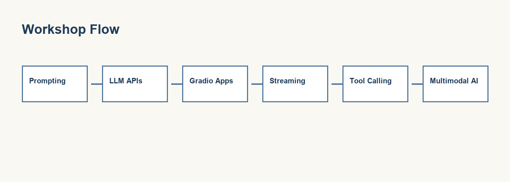

# Generative AI Practical Workshop


Hands-on materials for a university session on prompting, small LLM apps, and multimodal AI.

You will work mainly in **Jupyter notebooks**. The `src/` folder holds helper code so notebook cells stay short and readable — you are not expected to build a full production app.

**One cloud API key or Ollama is enough.** You do not need every provider in `.env.example`.

---

## What you will learn

By the end of the three notebooks, you should be able to:

- Write prompts that are clear enough to test and trust
- Wrap a prompt in a simple interface other people can use
- Combine an LLM with real tools (weather, exchange rates) and other outputs (audio, images)
- Think about privacy, grounding, and responsible use in a university setting

---

## Before the workshop

Do this once at home so we can focus on ideas in class.

### 1. Set up Python and dependencies

```bash
cd generative-ai-workshop
python -m venv .venv
source .venv/bin/activate          # Windows: .venv\Scripts\activate
pip install -r requirements.txt
```

### 2. Configure your environment (secrets)

```bash
cp .env.example .env
```

| File | Purpose |
|------|---------|
| `.env.example` | Template in the repo — variable names only, no real keys |
| `.env` | Your private copy — paste real API keys here |

Open `.env` and add **one** provider you have access to, or skip this step if you will use **Ollama** locally.

**Never commit `.env`.** If a key is pushed to GitHub by mistake, revoke it on the provider’s site immediately.

### 3. Optional: Ollama (local, no cloud key)

1. Install from [ollama.com](https://ollama.com)
2. Run `ollama serve`
3. Pull a model, e.g. `ollama pull llama3.2` (any installed model works)

### 4. Start Jupyter from the project root

The folder you launch from must contain both `src/` and `notebooks/`.

```bash
jupyter notebook
```

Open the notebooks **in order** and run cells from top to bottom.

If you see `ModuleNotFoundError: No module named 'src'`, restart the kernel and re-run the first setup cell — or confirm you started Jupyter from the project root, not from inside `notebooks/`.

---

## The notebooks



Work through these in order. Each one builds on the last.

### Notebook 1 — Prompt Engineering Lab

**File:** `notebooks/01_prompt_engineering_lab.ipynb`

**Big question:** Is the prompt good enough to trust?

Most people type into ChatGPT and hope for the best. Here we slow down. You write prompts, run them, compare answers, and score what comes back.

**What you will do:**

- Compare a vague prompt with a structured one on the same task
- Practise summarising, classifying, and step-by-step reasoning
- Use a simple rubric (clarity, faithfulness, usefulness, safety, …)
- Try “LLM-as-judge” — and discuss why a human still needs to review the result

**Main helpers used:** `src/llm_gateway.py`, `src/prompt_templates.py`, `src/output_formatting.py`

---

### Notebook 2 — Build a Simple LLM App with Gradio

**File:** `notebooks/02_build_simple_llm_app_gradio.ipynb`

**Big question:** How do you package a prompt so someone else can use it without writing Python?

Notebook 1 was about the words you send to the model. This one is about **delivery**: a function first, then buttons and text boxes.

**What you will do:**

- Call a learning-support function directly (no UI yet)
- Launch a **Learning Support Assistant** — task type, audience, presets, export
- Build a **chatbot** and a **streaming chatbot** with Gradio
- See why streaming feels faster even when total time is similar

**Main helpers used:** `src/gradio_apps.py`, `src/llm_gateway.py`, `src/prompt_templates.py`

---

### Notebook 3 — Multimodal Travel Guide Agent

**File:** `notebooks/03_multimodal_tour_guide_agent.ipynb`

**Big question:** How do you stop the model from guessing facts it should look up?

Imagine travelling from your city to an African city for a workshop. You want real weather and exchange-rate data, a grounded written brief, and optional audio and a poster.

**What you will do:**

- Call travel tools **before** the LLM (weather, distance, exchange rate, places)
- Pass tool results into the prompt so the model explains facts instead of inventing them
- Generate audio (text-to-speech) and a travel poster
- Launch the full **Tour Guide** Gradio app

**Main helpers used:** `src/travel_tools.py`, `src/image_generation.py`, `src/gradio_apps.py`, `src/prompt_templates.py`, `src/output_formatting.py`

**Reminder:** This is a teaching demo, not live travel advice. Verify visas, health guidance, and safety with official sources before real trips.

---

## The `src/` folder

You can complete the workshop from the notebooks alone. Open these files when you want to see *how* something works under the hood.

| File | What it does | Used in |
|------|----------------|---------|
| `llm_gateway.py` | One place to call cloud APIs and Ollama. Includes `run_llm()`, `stream_llm()`, and `check_available_providers()`. With `provider="auto"`, it picks the first provider that is configured and available. | All notebooks |
| `prompt_templates.py` | Reusable prompt patterns: learning support, travel brief, presets, and a simple evaluation rubric. | Notebooks 1–3 |
| `gradio_apps.py` | Gradio interfaces: learning support app, chatbots (with optional streaming), and the multimodal tour guide. | Notebooks 2–3 |
| `travel_tools.py` | Fetches weather, distance, exchange rates, and suggested places. Facts come from APIs or curated fallbacks — not from the LLM. | Notebook 3 |
| `image_generation.py` | Text-to-speech and travel poster generation (cloud image APIs when keys exist; Pillow fallback offline). | Notebook 3 |
| `output_formatting.py` | Turns raw LLM text into readable markdown and nicer tables for notebooks and Gradio. | Notebooks 1–3 |
| `utils.py` | Paths, loading `.env`, reading sample texts, saving outputs to `data/outputs/`. | All helpers |

**Typical flow in Notebook 3:**

```text
travel_tools  →  gather facts
      ↓
prompt_templates  →  build grounded prompt
      ↓
llm_gateway  →  generate brief
      ↓
image_generation  →  audio + poster
      ↓
gradio_apps  →  show everything in one UI
```

---

## Project layout

```text
generative-ai-workshop/
├── notebooks/                 ← start here (01 → 02 → 03)
├── src/                       ← helper modules (see table above)
├── data/
│   ├── sample_texts/          ← example inputs for Notebook 1
│   └── outputs/               ← saved transcripts, images, logs
├── assets/                    ← banner and workshop flow diagram (used in README & Notebook 1)
├── .env.example               ← copy to .env (committed, no secrets)
├── .env                       ← your keys (local only — gitignored)
└── requirements.txt
```

---

## Choosing a model provider

Supported: OpenAI, Anthropic, Gemini, Mistral, Cohere, DeepSeek, Groq, OpenRouter, and **Ollama** (local).

In any notebook:

```python
SELECTED_PROVIDER = "auto"   # first available provider
# or, for example:
SELECTED_PROVIDER = "ollama"
SELECTED_PROVIDER = "openai"
```

Run `check_available_providers()` in the setup cells to see what is ready on your machine.

---

## Privacy and responsible use

- Do not paste passwords, exam scripts, student records, or private documents into cloud models.
- For sensitive topics, prefer **Ollama locally** or anonymised sample data.
- The Gradio apps include a reminder not to paste private data; in a real product you would also log errors, limit input length, and document what leaves the machine.

---

## Common issues

| Problem | What to try |
|---------|-------------|
| `No module named 'src'` | Start Jupyter from the project root; re-run the first setup cell |
| Ollama model not found | Run `ollama list` and use an installed model, or `ollama pull llama3.2` |
| Gradio app errors on Send | Restart the kernel after pulling the latest code; confirm Ollama is running |
| `load_dotenv` returns `False` | Normal if `.env` is missing — run `cp .env.example .env` |
| Exchange rate error | Use valid 3-letter currency codes (e.g. `RWF`, `GHS`) |

---

## The point of the workshop

Chatting with AI is easy. The skill is making outputs **useful, testable, and responsible** — especially when students and staff depend on them.

Questions or improvements? Open an issue or talk to your facilitator after the session.
